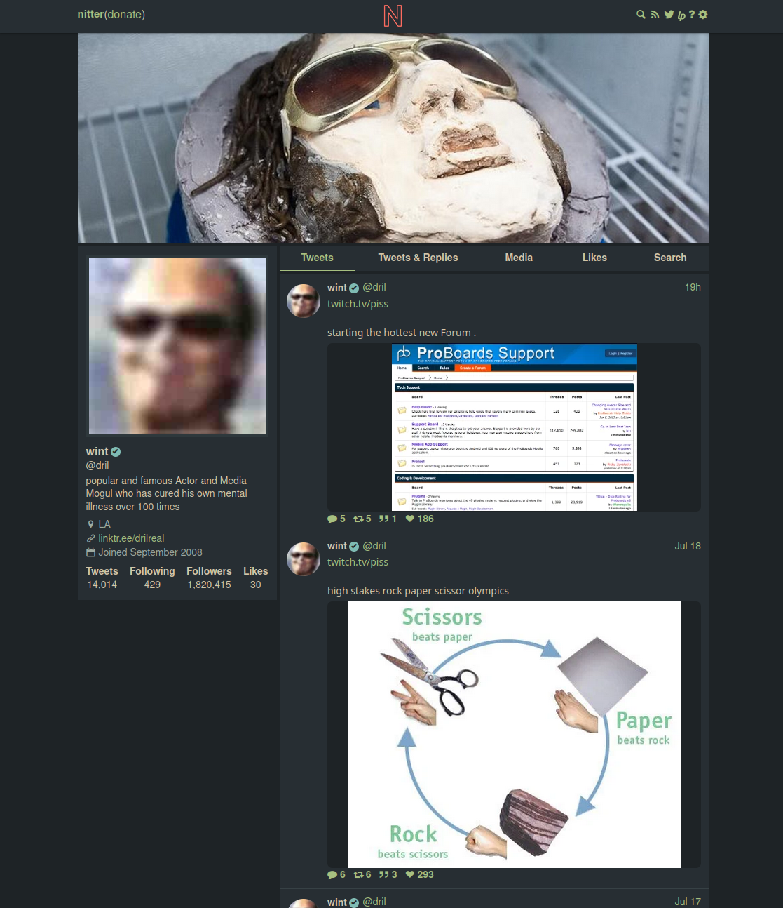

# Everforest for Nitter

  

The [Everforest](https://github.com/sainnhe/everforest) theme ported to the [Nitter](https://github.com/zedeus/nitter) private front-end for Twitter. Supports both variants (dark, light) and three contrast settings (soft, medium, hard).

## Usage

1. Add the [Stylus extension](https://github.com/openstyles/stylus) to your browser.
2. Visit [this link](https://github.com/isaac-8601/nitter-everforest/raw/main/everforest.user.css) and click the install button.
3. Add your Nitter server's domain name to the list of domains near the top of the stylesheet, if it's not there already.
4. Set your preferred palette settings in the customization menu for Nitter Everforest.
